# Bycicle Counter
UC Davis ECS 171 FInal Project

## Abstract

Group members:
- Timothy Blanton
- Sohan Patil
- Ru Han Wang
- Clément Weinreich

The goal of our project is to address the problem of adapting infrastructure to cyclist flows. On campus, for example, it is difficult to estimate the number of bicycle parking spaces needed for different areas and buildings. We therefore want to create an automatic detector and counter of cyclists using a Jetson Nano. Once our project is completed, it would be possible to capture data about the flow of cyclists at different locations, and to use this data to make predictions or estimates of cyclist flows. To complete this project, we plan to use transfer-learning on a pre-trained object detection model, which means re-train the classification layer of the deep convolutional neural network on a custom dataset in order to create our own cyclist detector. To do so, we plan to use the [Tensorflow 2 Object Detection API](https://tensorflow-object-detection-api-tutorial.readthedocs.io/en/latest/index.html), and use one of their pre-trained model which will be a deep convolutional neural network. The dataset we will use is the [Cyclist Dataset for Object Recognition](https://www.kaggle.com/datasets/semiemptyglass/cyclist-dataset) published by [1] in 2016. It contains 13.7k labeled images of size 2048 x 1024, recorded from a moving vehicle in the urban traffic of Beijing. The labels contain the positions of the bounding boxes around the cyclists in this format: `id center_x center_y width height`. Then, we plan to implement our own algorithmic-based tracking system that would allow us to count the number of cyclists detected over a period of time.

## Setup Requirements 

Follow the steps below, or clone the repository and run the notebook [setup_install.ipynb](setup_install.ipynb).

* Clone the repository :
```
git clone git@github.com:Clement-W/bicycle-counter.git
cd bicycle-counter
```

* Download the data :
```
wget --load-cookies /tmp/cookies.txt "https://docs.google.com/uc?export=download&confirm=$(wget --quiet --save-cookies /tmp/cookies.txt --keep-session-cookies --no-check-certificate 'https://docs.google.com/uc?export=download&id=1u39ZCDroyUpguicPMUZ20eIeux2N7uql' -O- | sed -rn 's/.*confirm=([0-9A-Za-z_]+).*/\1\n/p')&id=1u39ZCDroyUpguicPMUZ20eIeux2N7uql" -O images.zip && rm -rf /tmp/cookies.txt
```
The data can also be download manually [here](https://drive.google.com/file/d/1u39ZCDroyUpguicPMUZ20eIeux2N7uql/view?usp=sharing).

* Unzip and delete the zip file :
```
unzip images.zip
rm images.zip
```

* [Optional if you don't want to train a model] Install every dependences necessary to train an object detection neural net with tensorflow object detection API. To do so, you can follow the installation instructions from the [official tensorlow object detection API](https://tensorflow-object-detection-api-tutorial.readthedocs.io/en/latest/install.html).

Now you're all set!

## Data Exploration

The data exploration phase is split into 2 notebooks :
1. [adapt_dataset.ipynb](adapt_dataset.ipynb) 

The first notebook contains the steps to adapt the original dataset, and make it usable for our project. In fact, when we downloaded the dataset, we discovered that 1623 images out of 13674 were not labelled. These images had an empty `.txt` file as a label. Thus we decided to remove theses images, so the dataset was reduced to 12051 images. Thanks to the python library `pylabel`, we loaded the dataset as a dataframe in order to explore this new version of the dataset. This library was useful in particular to convert the label format from Yolov5 to VOC XML. As the tensorflow object detection API works with the VOC XML format, this step was mandatory. So we removed the `.txt` label and keept the new `.xml` labels. After that, we used a script from the tensorflow object detection API to split our dataset into 3 sets : 
* 90% for the train set (9760 images)
* 10% for the test set (1206 images)
* 10% of the 90% train set for the validation set (1085 images)


All these manipulations necessited to manage folders and files with command lines, that's why this notebook can't be run anymore. Before executing this notebook, the main folder looked like this:

* `images/` contains 13 674  images
* `labels/` contains 13 674 .txt files (yolo bounding box format) with this format `id center_x center_y width height`


After running this notebook the main folder looked like this:

* `adapt_dataset.ipynb` this jupyter notebook
* `tensorflow-scripts/` contains the scripts from tensorflow
    * `partition_dataset.py` python script to split a folder of images with labels into 2 subfolders train and test
* `images/` contains the data
    * `train/` contains 9760 images and labels of the train set 
    * `test/` contains 1085 images and labels of the test set
    * `validation/` contains 1206 images and labels of the validation set

<!-- #region -->
Now that the dataset is usable for the project, we can perform some data analysis on it.

2. [data_exploration.ipynb](data_exploration.ipynb)

This notebook contains all the work done to explore the dataset. In this notebook, we:
* Load the dataset as a pandas dataframe thanks to the pylabel library
* Analyze the the number of images, of bounding boxes
* Analyze the images 
* Analyze the repartitions of the bounding boxes
* Visualize some samples from train,test and validation set.
* Analyze the repartitions of small/medium/large bouding boxes in the dataset

## Data Preprocessing

### Data preprocessing with tensorflow 2 object detection API

For our project, the data preprocessing was mixed with the data exploration, because the dataset needed to be modified in order to be compatible with the task we want to perform. But now that the dataset has been prepared, and that we explored it a little bit more, we can take a look at the data preprocessing we will setup in order to use the data during training.

The Tensorflow 2 Object Detection API allows to do data preprocessing and data augmentation in the training pipeline configuration. As stated in their [docs](https://github.com/tensorflow/models/blob/master/research/object_detection/g3doc/configuring_jobs.md#configuring-the-trainer), all the preprocessing of the input is done in the `train_config` part of the training configuration file. The training configuration file is explained in the section [Configure the training pipeline](#Configure-the-training-pipeline-(configure_training_pipeline.ipynb)) of this README.md. 

So here, the important part of the configuration file is `train_config` which parametrize:
* Model parameter initialization
* Input Preprocessing
* SGD parameters

Here we will focus on the Input Preprocessing part of the config file. All this preprocessing is included in the `data_augmentation_options` tag of the `train_config`. This data_augmentation_options can take several values that are listed [here](https://github.com/tensorflow/models/blob/master/research/object_detection/protos/preprocessor.proto). And [this file](https://github.com/tensorflow/models/blob/master/research/object_detection/builders/preprocessor_builder_test.py) also explains how to write them into the config file. 

### Data Augmentation

The pipeline that specify the data augmentation options that will be applied to the images is created in [configure_training_pipeline.ipynb](configure_training_pipeline.ipynb).

First, our images are very big (2048x1024). Thus, it is important to resize them in order to make it compatible with the input layer of the neural network we'll use. The model that we chose has an input layer of 640x640. And the first layer consists in an [image-resize layer](https://www.tensorflow.org/api_docs/python/tf/keras/layers/Resizing). So we don't need to deal with the size of our images, as these images will be automatically resized to the desired input size when feeded to the network.

Now, let's focus on data augmentation. Data augmentation englobe techniques used to increase the amount of data, by adding to the dataset slightly modified copies of already existing data. Data augmentation helps to reduce overfitting by helping the network to generalize over different examples. This is closely related to oversampling. Here, we used 3 different methods to augment our data:
* **random_scale_crop_and_pad_to_square**: Randomly scale, crop, and then pad the images to fixed square dimensions. The method sample a random_scale factor from a uniform distribution between scale_min and scale_max, and then resizes the image such that its maximum dimension is (output_size * random_scale). Then a square output_size crop is extracted from the resized image. Lastly, the cropped region is padded to the desired square output_size (640x640 here) by filling the empty values with zeros.
* **random_horizontal_flip**: Randomly flips the image and detections horizontally, with a probability p. Here we chose p=0.3, so the probability that an image is horizontally flipped is 30%.
* **random_distort_color**: Randomly distorts color in images using a combination of brightness, hue, contrast and
  saturation changes. By using the parameter `color_ordering=1`, the sequence of adjustment performed is :
  1. randomly adjusting brightness
  2. randomly adjusting contrast
  3. randomly adjusting saturation 
  4. randomly adjusting hue.
  
We choosed to use the random scale,crop and pad to square data augmentation option because during the data exploration phase, we noticed that most of the cyclists were in the center of the image. Thus, to give different examples to the model, this data augmentation option will create other images where the cyclists won't be in the center of the image.

We choosed to use the horizontal_flip data augmentation option because this will create more examples to train the network. As the cyclists can come from the left,right or front of the camera, this data augmentation option will help the network to see diverse cases of cyclist positions.

We choosed to use the random_distort_color data augmentation option because during the data exploration phase, we noticed that the luminosity of the images are low, with a low contrast and a low saturation. Thus, this data augmentation option will help the network to see other examples with a different brightness, contrast, saturation and hue.
  
In the training configuration file, this will looks like this:
```py
  data_augmentation_options {
    random_horizontal_flip {
      probability: 0.3
    }
  }
  data_augmentation_options {
    random_scale_crop_and_pad_to_square {
      output_size: 640
      scale_min: 0.1
      scale_max: 2.0
    }
  }
  data_augmentation_options {
    random_distort_color {
      color_ordering: 1
    }
  }
```

It is important to note that all the data augmentation options will be applied on the images, before entering the resize layer. 

During the training phase, we can monitor many parameters with tensorboard (see [Train the model](#Train-the-model)). Tensorboard also offers the possibility to see some examples of input images after data augmentation. Here are 3 of them:

|                                                      Example 1                                                      	|                                                      Example 2                                                      	|                                                      Example 3                                                      	|
|:-------------------------------------------------------------------------------------------------------------------:	|:-------------------------------------------------------------------------------------------------------------------:	|:-------------------------------------------------------------------------------------------------------------------:	|
|  	|  	| 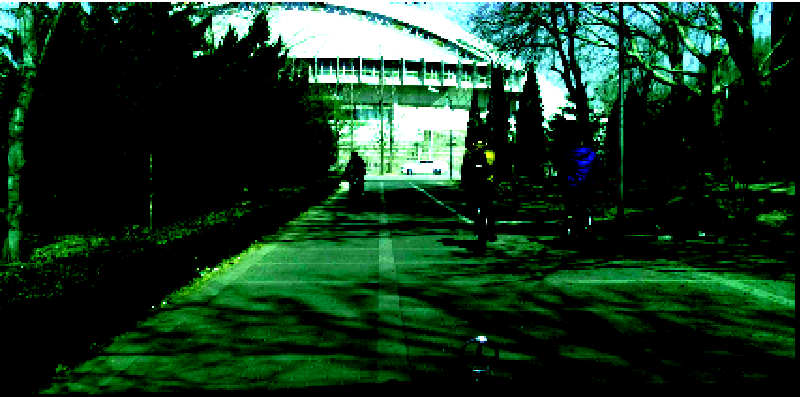 	|

These 3 examples shows images where the color have been distorded. And the first example have been randomly cropped and padded to a square (we can guess that it was the left part of the image).

Now that we have explored, preprocessed and set up a data augmentation pipeline for our data, we can move to the training job.

## Configure the training job

To follow this part, we assume you installed the required libraries to train an object detection neural net with the tensorflow 2 object detection API. If not, just follow the instructions [here](https://tensorflow-object-detection-api-tutorial.readthedocs.io/en/latest/install.html). If you don't plan to train the model, you don't need to install these libraries.

### The training workspace

To train our object detection model, we followed the [documentation](https://tensorflow-object-detection-api-tutorial.readthedocs.io/en/latest/training.html) of the Tensorflow2 Object Detection API. Thus, we organized the training workspace `training-workspace` the same way as it is recommended:

* annotations: This folder will be used to store all the TensorFlow *.record files, which contain the list of annotations for our dataset images.

* exported-models: This folder will be used to store exported versions of our trained model(s).

* models: This folder will contain a sub-folder for each of training job. Each subfolder will contain the training pipeline configuration file *.config, as well as all files generated during the training and evaluation of our model.

* pre-trained-models: This folder will contain the downloaded pre-trained models, which shall be used as a starting checkpoint for our training jobs.

### Generate .record files [(generate_tfrecords.ipynb)](generate_tfrecords.ipynb)

The Tensolfow API use what we call tf record files to store the data. It is a simple format that contains both the images and the labels in one file. To generate these files, we followed the documentation. Everything is explained in the notebook generate_tfrecords.ipynb. In the end, this add 3 new files to the folder `training-workspace/annotations`:
* `train.record`: the train set
* `validation.record`: the validation set
* `test.record`: the test set

The .record files are associated to a `label_map` file which tells the classes that must be classified in the dataset. Here we only want to classify the cyclists, so the label map is very simple:
```py
item {
    id: 1
    name: 'cyclist'
}
```
This label map is stored in `training-workspace/annotations/label_map.pbtxt` along with the .record files.

### Download Pre-Trained Model [(download_pretrained_network.ipynb)](download_pretrained_network.ipynb)

The pre-trained object detection models of the tensorflow object detection API are listed [here](https://github.com/tensorflow/models/blob/master/research/object_detection/g3doc/tf2_detection_zoo.md). Many different architecture exists such as RCNN, Faster-RCNN, SSD, etc. Today, it is EfficientNet based models (EfficientDet) that provide the best overall performances, and can work well for low latency applications. For example, `EfficientDet D1 640x640` can perform inference in 54ms on a nvidia-tesla-v100GPU, and obtain a COCO mAP (mean average precision) of 38.4 (the metrics will be discussed in the section [Monitoring-the-performance](#Monitoring-the-performance). We can try to use different pre-trained models and compare the performances, but this wil be done for a second version of this project.

The EfficientNet architecture has been proposed by [2] (EfficientNet: Rethinking Model Scaling for Convolutional Neural Network) in 2019. Here is the model architecture of the base EfficientNet model:

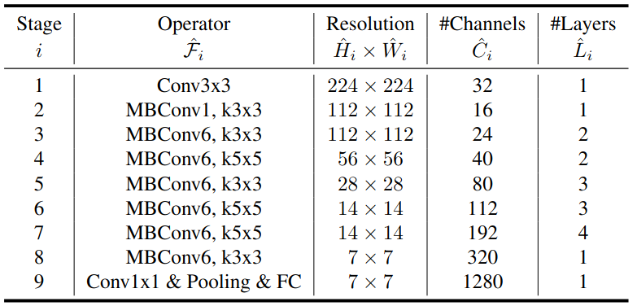

This table (from the original paper [2]) shows that the main block of this architecture is the MBConv. The MBConv is an inverted linear bottleneck layer, with depth-wise separable convolution. A depth-wise separable convolution conist of splitting a normal $k\times k$ convolution in two "simpler" convolutions, to reduce the number of parameters, and speed up the compute time. The inverted linear bottleneck layer change the output of the last convolution of a classic residual block by a linear output, before it is added to the initial activation by the skip connection. This architecture has shown better results in accuracy and in computer preformance (in FLOPS).

Thus, we decided to use `EfficientDet D1 640x640` as our pre-trained object detector. The last checkpoint of the training and the training configuration file is available in the directory `training-workspace/pre-trained-models/efficientdet_d1_coco17_tpu-32`.

### Configure the training pipeline [(configure_training_pipeline.ipynb)](configure_training_pipeline.ipynb)


The TensorFlow Object Detection API uses protobuf files to configure the training and evaluation process. The config file is split into 5 parts:
* The `model` configuration. This defines what type of model will be trained (ie. meta-architecture, feature extractor). Most of this part will not be modified as we'll use a pre-trained network, we won't modify it's architecture.
* The `train_config`, which decides what parameters should be used to train model parameters (ie. SGD parameters, input preprocessing and feature extractor initialization values). This part is very important as we can preprocess our data and do some data augmentation. 
* The `train_input_reader`, which defines what dataset the model should be trained on.
* The `eval_config`, which determines what set of metrics will be reported for evaluation.
* The `eval_input_reader`, which defines what dataset the model will be evaluated on. That's why we created a validation set for our data, in addition to the test set.

To redefine the training configuration through the file `pipeline.config`, we created the directory `efficientdet_d1_v1` into `training-workspace/models`. Then, we copied the configuration file into this directory in order to modify it, while keeping the original configuration file in the folder `training-workspace/pre-trained-models/efficientdet_d1_coco17_tpu-32`. 

The changes that have been done to this configuration file are:
* In `model`, we changed `num_classes` to 1 as we only want to predict the cyclists. This corresponds to changing the last dense layer of the neural network with only one neuron.


* In `train_config`, we changed the `batch_size` to 3 in order to fit the memory of the GPU used to train the network.
* In `train_config`, we added some data augmentation options (see [Data-Augmentation](#Data-Augmentation)).
* In `train_config`, changed the base learning rate to 0.02 to avoid exploding gradients.
* In `train_config`, we changed the path of `fine_tune_checkpoint` to the correct path, so the weights of the model are initialized at the last checkpoint.
* In `train_config`, we changed `fine_tune_checkpoint_type` from classification to detection since we want to be training the full detection model and not only the classification part.


* In `train_config`, we changed `use_bfloat16` to false as we are not training on a TPU but a GPU.


* In `train_input_reader`, we changed `label_map_path` to the correct path of the label map for training.
* In `train_input_reader`, we changed `input_path` to the path of the training set so `train.record`.


* In `eval_input_reader`, we changed `label_map_path` to the correct path of the label map for evaluation.
* In `eval_input_reader`, we changed `input_path` to the path of the validation set so `validation.record`.

For more details about the training configuration file, check the notebook `configure_training_pipeline.ipynb`. You can also access the [pipeline.config](training-workspace/models/efficientdet_d1_v1/pipeline.config) manually.
<!-- #endregion -->

<!-- #region -->
## Train the model

### Launch training and periodic evaluation

To train the model, and include a periodic evaluation of the model with the validation set, you need to open 2 terminal:
* Train the model in the first terminal with
```sh
cd training-workspace
python ../tensorflow-scripts/model_main_tf2.py --model_dir=models/efficientdet_d1_v1 --pipeline_config_path=models/efficientdet_d1_v1/pipeline.config
```
* Launch periodic evaluation in the other terminal with
```sh
cd training-workspace
python ../tensorflow-scripts/model_main_tf2.py --model_dir=models/efficientdet_d1_v1 --pipeline_config_path=models/efficientdet_d1_v1/pipeline.config --checkpoint_dir=models/efficientdet_d1_v1
```
The model was trained for 2 days (50 hours) on a NVIDIA 3060TI. If you want to access the model directory which contains all the training checkpoints, the evaluation reports (as .tfevents files), you can download the folder `efficientdet_d1_v1`, and replace the current folder `training-workspace/models/efficientdet_d1_v1` by the new one. To download it:

* Download the efficientdet_d1_v1 folder :
```
wget --load-cookies /tmp/cookies.txt "https://docs.google.com/uc?export=download&confirm=$(wget --quiet --save-cookies /tmp/cookies.txt --keep-session-cookies --no-check-certificate 'https://docs.google.com/uc?export=download&id=1ClnmwtBJbP6FIJNP2WWV8ZwfgWxiPFxX' -O- | sed -rn 's/.*confirm=([0-9A-Za-z_]+).*/\1\n/p')&id=1ClnmwtBJbP6FIJNP2WWV8ZwfgWxiPFxX" -O efficientdet_d1_v1.zip && rm -rf /tmp/cookies.txt
```
It can also be download manually [here](https://drive.google.com/file/d/1ClnmwtBJbP6FIJNP2WWV8ZwfgWxiPFxX/view?usp=sharing).

* Unzip and delete the zip file :
```
unzip efficientdet_d1_v1.zip
rm efficientdet_d1_v1.zip
```

You know have access to the result of the training phase.

### Monitor the training job using Tensorboard

To monitor how the training is going, a popular tool is [tensorboard](https://www.tensorflow.org/tensorboard). This tool is automatically installed with tensorflow. In case you just want tensorboard, you can still install it manually with `pip install tensorboard`. We will go over the details of the training in the next section [Analysis of the training phase](#analysis-of-the-training-phase). Here is what tensorboard looks like:

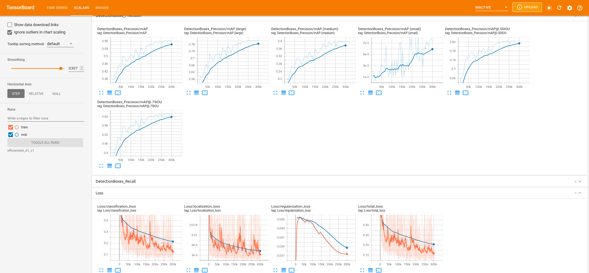

We uploaded our instance of tensorboard, so you can access it on [that link](https://tensorboard.dev/experiment/LMZdMvMxTwGcZ0ypzM7WGg/). Unfortunately, we can only publish the time series graphs, so you will not be able to see the image examples. But having that link open while reading this report, can help you to better understand the graphs, in particular by changing the smoothing cursor.

If you have downloaded the whole efficientdet_d1_v1 directory, (see [Launch training and periodic evaluation](#Launch-training-and-periodic-evaluation)), then you can open tensorboard in our model directory with this command:
```
tensorboard --logdir=efficientdet_d1_v1
```
You should then be able to review all the information of the training, including the image examples from data augmentation, and the predictions in the validation set.

## Analysis of the training phase

### Learning rate decay

The model was trained for 2 days. The training stopped automatically thanks to the cosine decay. When training models with millions of parameters (6.6 milions here), it is often recommended to lower the learning rate as the training progresses. Here, the cosine decay schedule is used. This schedule applies a cosine decay function to an optimizer step, given a provided initial learning rate (0.02 here). We started the training with a learning rate of 0.04, but after an hour of training, this has caused the gradients to explode. Thus, we decreased it to 0.02. Thanks to tensorboard, we can see how the learning rate has changed over the training with respect to the number of steps, or the time of training:

|                                  By number of steps                                  	|                                       By time                                      	|
|:------------------------------------------------------------------------------------:	|:----------------------------------------------------------------------------------:	|
| 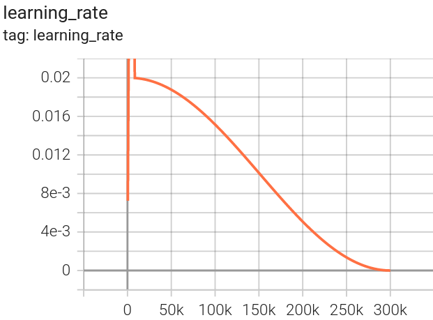 	| 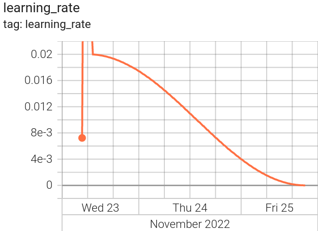 	|

We notice that at some point, the learning rate was equal to 0, which has stopped the training.

### Monitoring the loss

To fit the memory of the GPU that we used for the training, we had to set the batch size to 3. Even though it is a mini-batch gradient descent, the batch size remains very small, which is why it is very similar to a vanilla stochastic gradient descent. This causes the loss to vary a lot depending on the data contained in the batches. Thus, our loss curves consists of spikes which hardly show the tendency of these curves. To counter this, tensorboard offer the possibility to smooth the curves in order to make some curves more intelligible. The following curves that we will present are smoothed, but the actual curve is also displayed on the same graph with a low opacity.

As we are training an object detector, there is 4 loss that we need to take into account:
* The classification loss: Is the cyclists well classified as cyclists
* The localization loss: Is the bounding boxes close to the cyclists
* The regularization loss: Aims to keep the model parameters as small as possible
* The total loss: Sum of the classification, localization, and regularization loss.

Here are the 3 most relevant loss that we can analyze. The loss on the training set in orange, and the loss on the validation set is blue:

|                                              Classification loss                                              	|                                             Localization loss                                             	|                                          Total loss                                         	|
|:-------------------------------------------------------------------------------------------------------------:	|:---------------------------------------------------------------------------------------------------------:	|:-------------------------------------------------------------------------------------------:	|
| 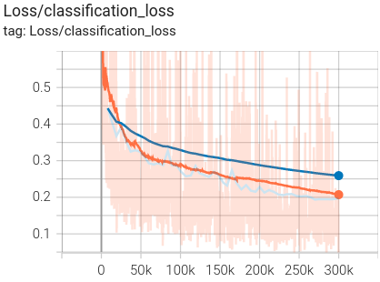 	| 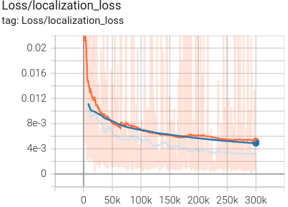 	| 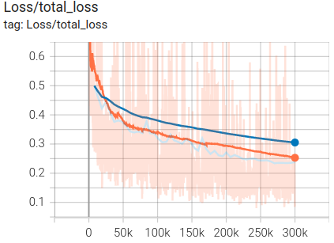 	|
<!-- #endregion -->

As you can see in low opacity, it is not so easy to discern the tendency of the loss curves. First, we can notice that in the 3 graphs, our training loss and validation loss are very close, so we can suppose that our model is not overfitting the training data. More particularly:

* The classification loss is decreasing in both training and validation set, so we can suppose that letting the training continue would have helped the network to better learn to classify the cyclists.
* The localization loss is very close to 0, and is close to be on a plateau. We can suppose that letting the training continue would have led to network to overfit the localization of the bounding boxes.
* The total loss was of course deacreasing as it is the sum of the two loss above.

Based on the error at each step, we can say that the model is fitting well the data from 50k steps, to the final step (300k). We can interpret these plots as seeing the complexity of the model and the error. Here, we can say that even though the model become more complex across the time, it is still fitting well the data. If we had more time to train the network, we could restart it on the last checkpoint, with a new base learning rate and see if the loss is still decreasing. This could maybe lead to better result, or cause overfitting. But this would probably mean to let the GPU run for 2 more days, which is costly in energy consumption.


### Monitoring the performance

During the training phase, an evaluation of the last checkpoint was performed every hour. During this evaluation, the evaluation loss was computed, but also the performance with the mAP (mean Average Precision) and mAR (mean Average Recall) metrics. These two metrics are popular to measure the accuracy of object detection models. These metrics uses the concept of IoU (Intersection over Union). The IoU measure the overlap between 2 boundaries. We use the IoU to measure how much the predicted bounding box overlaps with the actual bounding box that must be predicted. Usually, we define the IoU threshold to 0.5, so if the IoU is equal or greater than 0.5, then we say that the prediction is a true positive, else it is a false positive. Thus, in the pipeline.config file, the IoU threshold is defined at 0.5.

To compute the mAP, we first need to compute the precision and recall of detecting the bounding boxes correctly (thanks to the IoU) for each images. Then, we can plot a graph of precision vs recall. To compute the AP, we just need to compute the area under the precision-recall curve, using an interpolation technique. The COCO mAP impose to do a 101-point interpolation to calculate the precision at the 101 equally spaced recall level, and then average them out. To have the mAP, we just need to take the mean over all classes, but as we only have one class here, the mAP is equivalent to the AP.

Then we also use the AR (Average Recall), which consist of averaging the recall at IoU thresholds from 0.5 to 1, and thus summarize the distribution of recall across a range of IoU thresholds. So we can plot the recall values for each IoU threshold between 0.5 and 1. Then, the average recall describes the area doubled under the recall-IoU curve. Similarly to mAP, the mAR take the mean of the AR for every class. So the mAR is here equivalent to the AR.

These metrics are really interesting because they evaluate the performance of the model to place the bounding boxes according to the classes. We can monitor these metrics in tensorboard and have an insight of the model's performance according to different cases. For the average precision we measured:
* The mAP at IoU varying from 0.5 to 0.95 (coco challenge metric) -> named mAP in tensorboard
* The mAP at IoU = 0.5 (PASCAL VOC challenge metric) -> named mAP@.50IOU in tensorboard
* The mAP at IoU = 0.75 (strict metric) -> named mAP@.75IOU in tensorboard
* The mAP for small objects (area < $32^2$) -> named mAP(small) in tensorboard
* The mAP for medium objects ( $32^2$ < area < $96^2$) -> named mAP(medium) in tensorboard
* The mAP for large objects (area > $96^2$) -> named mAP(large) in tensorboard

For the average recall we measured:
* The AR given images with 1 detection maximum -> named AR@1 in tensorboard
* The AR given images with 10 detection maximum -> named AR@10 in tensorboard
* The AR given images with 100 detection maximum -> named AR@100 in tensorboard
* The AR for small objects (area < $32^2$) -> named AR@100(small) in tensorboard
* The AR for medium objects ( $32^2$ < area < $96^2$) -> named AR@100(medium) in tensorboard
* The AR for large objects (area > $96^2$) -> named AR@100(large) in tensorboard


First, let's analyse the results of the average precision.


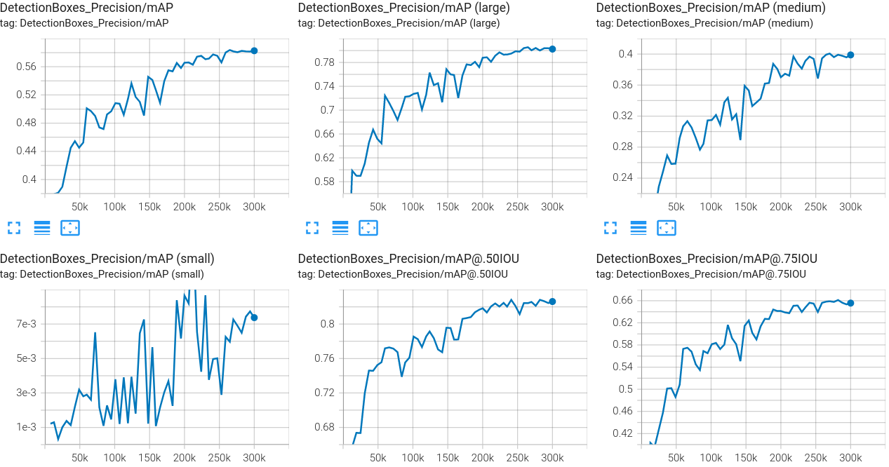

<!-- #region -->
Overall, the mAP is increasing no matter which value of IoU is used, or the size of the objects. The first plot show the general mAP (averaging on different values of IoU between 0.5 and 0.95), which is increasing but was starting to get on a plateau after 250k steps. We notice that the value of the mAP\@0.50IOU is larger than the value of the mAP\@0.75IOU, which is expected as 0.75 is a much more strict threshold. The mAP\@.75IOU on the last evaluation is approximately equal to 0.65, which is still very good.

To analyze the mAP according to different size of bounding boxes, we can refer to the data exploration notebook which contains the distribution of the width, and height of the bounding boxes. We need to be careful as the sizes of the predicted bounding boxes are in the 640x640 image, and not the 2048x1024 image. So we can convert the small(lesser than 32x32)/medium(between 32x32 and 96x96)/large(over 96x96) sizes so it is compatible with our data exploration image format:
* Converting width=32 in our 2048x1024 image scale : $\dfrac{2024 \times 32}{640} = 101.2 $


* Converting height=32 in our 2048x1024 image scale : $\dfrac{1024 \times 32}{640} = 51.2 $ 


* Converting width=96 in our 2048x1024 image scale : $\dfrac{2024 \times 96}{640} = 303.6 $


* Converting height=96 in our 2048x1024 image scale : $\dfrac{1024 \times 96}{640} = 153.6 $ 

So we have:

* **Small bouding boxes:** bounding boxes smaller than $101.2 \times 51.2$
* **Medium bouding boxes:** bounding boxes between than $101.2 \times 51.2$ and $303.6 \times 153.6$
* **Large bouding boxes:** bounding boxes greater than $303.6 \times 153.6$

To know the proportion of small, medium and large bounding boxes in our dataset, we modified the [data exploration notebook](data_exploration.ipynb). Thus, we know that our dataset contains:
* 40% of small bounding boxes
* 40% of medium bounding boxes
* 20% of large bounding boxes

To better understand what small/medium/large means, we also displayed examples containing different size of bounding box. This really helps to understand and interpret the results.

Knowing this, we can know better analyze the mAP according to the size of the bounding box. First we notice that the mAP for the small bounding box is close to 0. Knowing that 40% of bounding boxes are small, we can't say that it is because of the data. If we look at what small bounding boxes looks like in the data exploration notebook, we can understand how it is difficult to detect these bounding boxes. Thus, to use the model in order to count the cyclists, the camera needs to be closer than the examples showing small bounding boxes. Now if we look at the medium bounding boxes, the mAP on the last evaluation has reached 0.4 which is satisfying. If we look at what medium bounding boxes looks like in the data exploration notebook, we notice that some bounding boxes remains very close to the small ones. Then, if we look at the large bounding boxes, the mAP on the last evaluation has reached 0.8 which is very accurate. Thus, we can look at some examples containing large bounding boxes, and set up the camera at similar distances to count the cyclists effectively.

These results concerns the mean average precision, so contains mostly information about the proportion of true positive, so the percentage of the predictions that are correct. Now let's look at the Average Recall, which contains information about how good the bounding boxes are retrieved.
<!-- #endregion -->

Now let's look at the average recall.


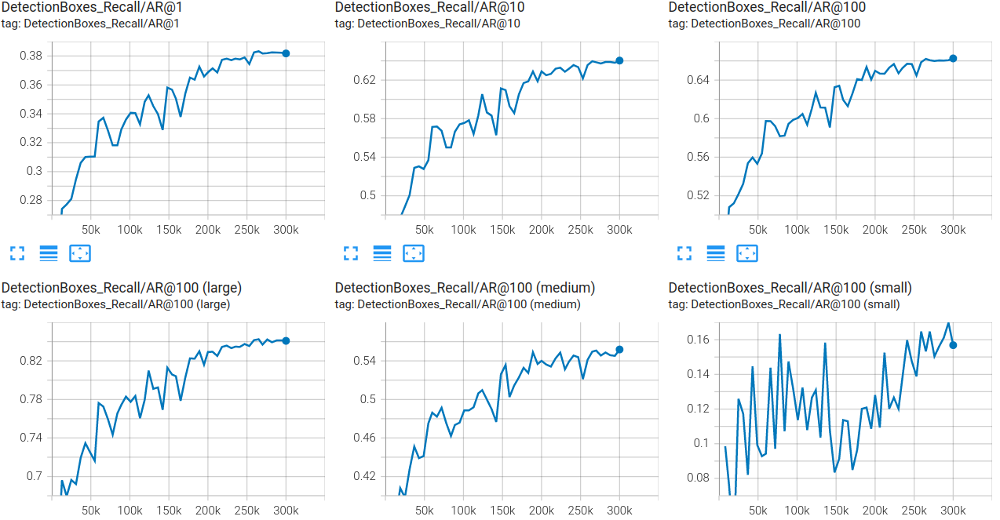


Again, the AR is increasing in every cases. The AR for images containing 1 bounding box reached 0.4 on the last evaluation. The AR for images containing at most 10 bounding boxes, the AR reached 0.64 which means that overall the true positive are well retrieved. The results of AR@10 and AR for images containing at most 100 bounding boxes are approximatively equivalent. This can be explained because there is not many images that have more than 10 bounding boxes. In the data_exploration notebook, we also added the frequency of number of bounding boxes present in the images. Thus, we know that only 42 images have more than 10 bounding boxes in the whole dataset. As it is evaluated on the validation set (1085 images), we can suppose that the number of images having more than 10 bounding boxes is way lesser than 42. So AR@10 and AR@100 are approximatively equivalent. 


Now if we focus on the AR depending on the size of the image, the results are very good. The AR for large images reached 0.84 on the last evaluation. The AR for medium images reached 0.55 on the last evaluation. The AR for small images reached 0.16 on the last evaluation. These also show that closer the cyclysts are to the camera, better the results. But it also show that in general, the bounding boxes are well retrieved by the model, which is positive.


### Visualize some predictions during model evaluation

When the model is evaluated, tensorboard will allow us to see 10 images with our model predictions. 

|     Stage of training     	|                                  Prediction VS Ground truth                                  	|
|:-------------------------:	|:--------------------------------------------------------------------------------------------:	|
|      First evaluation     	| 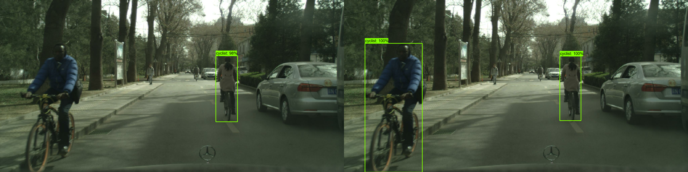 	|
| Second to last evaluation 	| 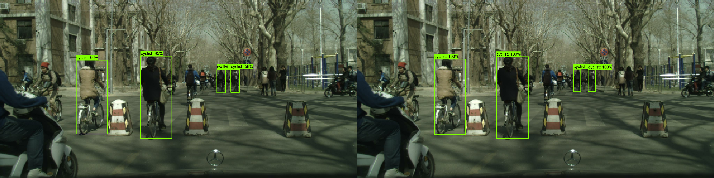 	|
| Last evaluation           	| 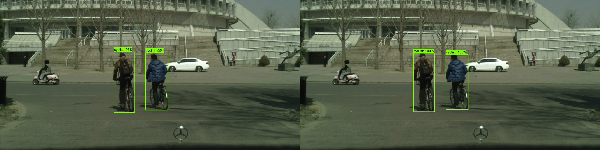 	|
| Last evaluation           	| 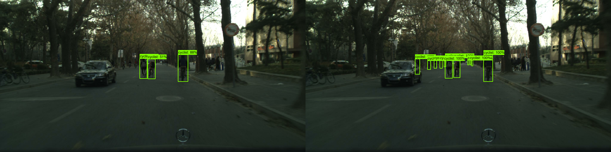 	|


Vizualizing the predictions of the model during evaluation really show that our model has well generalized the representation of a cyclyst, and is able to recognize them with a very good accuracy. As we'll be counting the cyclist from a video (so a flux of images), we can be certain that most of the cyclists will be recognized.


<!-- #region -->
## Evaluate the final model

To test the model, we used a similar approach as what we did for training. First, we created a new folder `models/efficientdet_d1_v1_test` which contains the last checkpoint of the training, and a copy of the pipeline.config flie. Do to this last evaluation and be able to compare the final loss and performance metrics, we evaluated the model on the whole test, validation and training set. This would gave us 3 scalars for each performance metrics, and loss values. We could visualize these results with tensorboard as we did it before, but it is not very relevant here as we only have one data point per set. Thus, we decided to export those results to a pandas dataframe. The only way we found to do this, is to export the folder `models/efficientdet_d1_v1_test` to the tensorboard dev API, and then import the data as a pandas dataframe.  To do so, we first needed to create a new project in the tensorboard dev API:
```sh
tensorboard dev upload --logdir training-workspace/models/efficientdet_d1_v1_test
```
In a new terminal, we then ran the evaluations on each set. To run the evaluation with the test set, we did:

- In the eval_input_reader part of the copy of pipeline.config, we changed input_path to `annotations/test.record`.
- Then we launched the evaluation command (which is the same as the one we used during training):
```sh
cd training-workspace
python ../tensorflow-scripts/model_main_tf2.py --model_dir=models/efficientdet_d1_v1_test --pipeline_config_path=models/efficientdet_d1_v1_test/pipeline.config --checkpoint_dir=models/efficientdet_d1_v1_test
```
- A folder named eval has been created in `models/efficientdet_d1_v1_test`, which contains the .tfevents file corresponding to the evaluation of the test set. Thus, we moved it in its corresponding folder:
```sh
cd models/efficientdet_d1_v1_test
mkdir test
mv eval/*.tfevents test
```
The, we repeted these steps for the training and validation set, just by replacing the input_path in the pipeline by `annotations/validation.record` or `annotations/train.record`, and in the last step, create the folders `validation` and `training` and move the .tfevents files accordingly to their respective folder.

Once it is done, we have the 3 evaluation folders `models/efficientdet_d1_v1_test/training`,`models/efficientdet_d1_v1_test/test` and `models/efficientdet_d1_v1_test/validation`. We also have an empty `models/efficientdet_d1_v1_test/eval` folder that we deleted: `rmdir models/efficientdet_d1_v1_test/eval`.

The results can be seen online on the [associated tensorboard](https://tensorboard.dev/experiment/dTD0vaI3SdyRZYI4WLHRbg/#scalars&runSelectionState=eyJldmFsIjpmYWxzZX0%3D) but this is not so relevant as it is just data point. To do the conversion into a pandas dataframe, we used the tensorboard library in python. This work can be found in the [evaluate_model.ipynb](evaluate_model.ipynb) notebook.

If you want to download the folder `efficientdet_d1_v1_test` which contains the evaluations results as .tfevents files, you can do it by following these steps:

* Download the `efficientdet_d1_v1_test` folder :
```
wget --load-cookies /tmp/cookies.txt "https://docs.google.com/uc?export=download&confirm=$(wget --quiet --save-cookies /tmp/cookies.txt --keep-session-cookies --no-check-certificate 'https://docs.google.com/uc?export=download&id=1Q_usxj2k0waHw4-6epKXPxcdn_GG3D1f' -O- | sed -rn 's/.*confirm=([0-9A-Za-z_]+).*/\1\n/p')&id=1Q_usxj2k0waHw4-6epKXPxcdn_GG3D1f" -O efficientdet_d1_v1_test.zip && rm -rf /tmp/cookies.txt
```
It can also be download manually [here](https://drive.google.com/file/d/1Q_usxj2k0waHw4-6epKXPxcdn_GG3D1f/view?usp=sharing).

* Unzip, delete the zip file, and move the folder at its proper place :
```
unzip efficientdet_d1_v1_test.zip
rm efficientdet_d1_v1_test.zip
mv efficientdet_d1_v1_test training-workspace/models/
```

## Comments on model evaluation

The full results of model evaluation can be seen in the [evaluate_model.ipynb](evaluate_model.ipynb) notebook. Let's focus on the obtained losses:

|           	| Classification loss 	| Localization loss 	| Total loss 	|
|-----------	|:-------------------:	|:-----------------:	|------------	|
| Test set  	| 0.223413            	| 0.003314          	| 0.264104   	|
| Train set 	| 0.181020            	| 0.003023          	| 0.221419   	|
| Test set  	| 0.197278            	| 0.003231          	| 0.237886   	|


The validation and train loss are pretty close. The test loss is a bit higher (0.04 higher than the train loss). Even though this difference is very small, we could think that it is due to overfitting. According to the loss curves presented in [Monitoring-the-loss](#Monitoring-the-loss), the evaluation on validation set was very close to the training set during the whole training, which is not an indication of overfitting. So the fitting graph was not showing a sign of overfitting. In addition, the validation set have a loss close to the training set. As the validation set has never been used to update the weights during training (the gradients are not computed during evaluation), this shows that the model generalized well enough, without overfitting the training data. If we focus more on the resuts of the evaluation on test set, we notice that this difference of loss is mainly due to the classification loss which is 0.04 higher than the train set. Thus, this difference can be due to the data in the test set which can be slightly harder to classify, with harder examples.

## Export the model

Now that the model is trained, we can export it as a .pb file. To do so, we can use the tensorflow script `exporter_main_v2.py` and execute:
```
python tensorflow-scripts/exporter_main_v2.py --input_type image_tensor --pipeline_config_path training-workspace/models/efficientdet_d1_v1/pipeline.config --trained_checkpoint_dir training-workspace/models/efficientdet_d1_v1 --output_directory training-workspace/exported-models/my_model
```
Now, we can use this model to perform inference.

If you want to download the model, you can do it that way:

* Download the my_model folder :
```
wget --load-cookies /tmp/cookies.txt "https://docs.google.com/uc?export=download&confirm=$(wget --quiet --save-cookies /tmp/cookies.txt --keep-session-cookies --no-check-certificate 'https://docs.google.com/uc?export=download&id=1BWaKL_VMOQ89Nuw5NEdRUv4Jl6GP6trC' -O- | sed -rn 's/.*confirm=([0-9A-Za-z_]+).*/\1\n/p')&id=1BWaKL_VMOQ89Nuw5NEdRUv4Jl6GP6trC" -O my_model.zip && rm -rf /tmp/cookies.txt
```
It can also be download manually [here](https://drive.google.com/file/d/1BWaKL_VMOQ89Nuw5NEdRUv4Jl6GP6trC/view?usp=sharing).

* Unzip, delete the zip file, and move the exported model at its proper place :
```
unzip my_model.zip
rm my_model.zip
mv my_model training-workspace/exported-models/
```

<!-- #endregion -->

## Use our model with Hugging Face Spaces

If you want to play with our cyclist detector model, you can use the hugging face spaces created for this model: [cyclists-detection](https://huggingface.co/spaces/clement-w/cyclists-detection). You can upload images by URL, or from your computer. This is what the HF Spaces looks like:
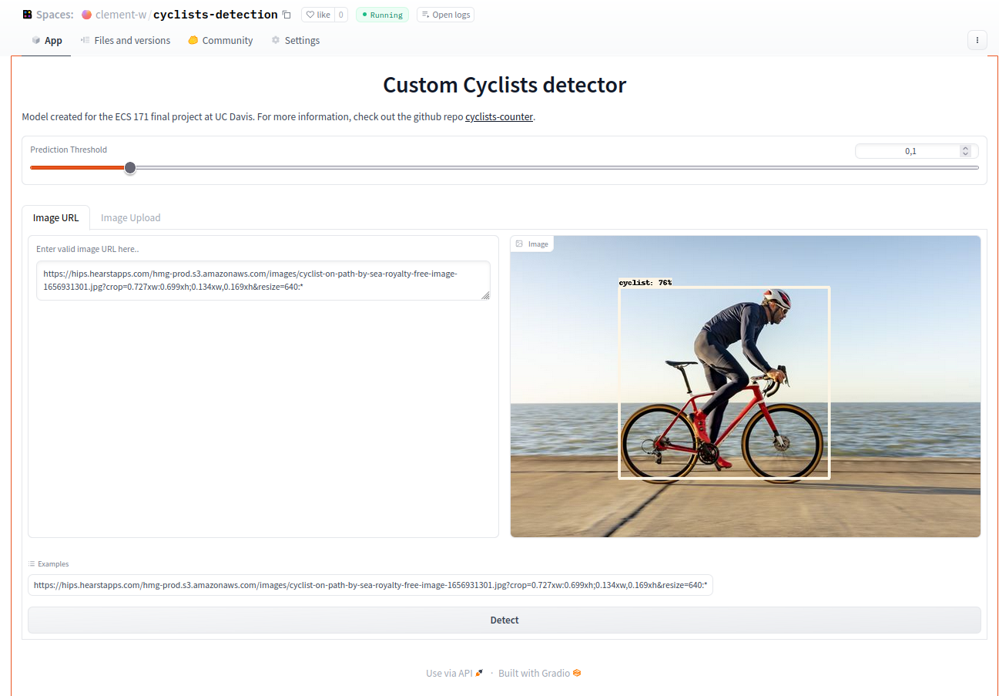

<!-- #region -->
## Counting algorithm

TODO

## Setup of the Jetson Nano

to complete

## Inference on Jetson Nano

TODO

## Results

TODO


## Conclusion

Conclude on results
Aware of memory leakage because images come from a continuous traffic from a driving car, and the sets have been randomly splitted. 

## References

[1] X. Li, F. Flohr, Y. Yang, H. Xiong, M. Braun, S. Pan, K. Li and D. M. Gavrila. A New Benchmark for Vision-Based Cyclist Detection. In Proc. of the IEEE Intelligent Vehicles Symposium (IV), Gothenburg, Sweden, pp.1028-1033, 2016.

[2] Tan, Mingxing, and Quoc Le. "Efficientnet: Rethinking model scaling for convolutional neural networks." International conference on machine learning. PMLR, 2019.
<!-- #endregion -->
